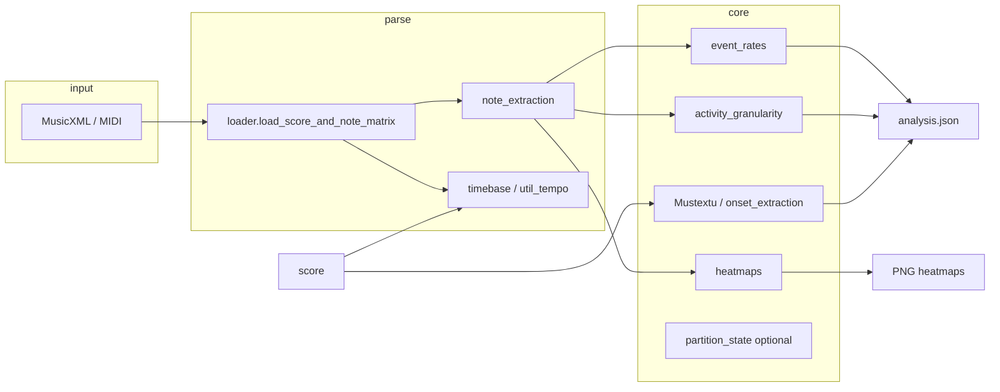

# Granularity Analyser — Technical Manual

**Version:** 1.0.9  
**Package:** `granular_v2`  
**Repository:** https://github.com/LuisMRaimundo/Granularity-Analyser

This manual documents purpose, architecture, **mathematical definitions**, and **algorithms implemented in this project**. Behaviour delegated to external libraries (music21 parsing, NumPy linear algebra, SciPy Gaussian filters) is named but not re-derived.

**Companion documents:** [MANUAL_METRICAS.md](MANUAL_METRICAS.md) (quick reference), [LIMITATIONS.md](LIMITATIONS.md), [OFFSET_AUDIT.md](OFFSET_AUDIT.md).

---

> **Metric interpretive limits:** [METRIC_SEMANTICS.md](METRIC_SEMANTICS.md) (VD4 fused-onset IOI/EPS, Mustextu synchrony, **VD10 registral trajectory vs granularity**).

## Table of contents

1. [Introduction](#1-introduction)
2. [Tutorial](#2-tutorial)
3. [Architecture and data flow](#3-architecture-and-data-flow)
4. [Input layer and time axis](#4-input-layer-and-time-axis)
5. [Event rates](#5-event-rates)
6. [Activity granularity and IOI](#6-activity-granularity-and-ioi)
7. [Temporal density](#7-temporal-density)
8. [Mustextu horizontal density](#8-mustextu-horizontal-density)
9. [Heatmaps](#9-heatmaps)
10. [Registral trajectory (VD10)](#10-registral-trajectory-vd10)
11. [Partitional layer (optional)](#11-partitional-layer-optional)
12. [Exported JSON schema](#12-exported-json-schema)
13. [Configuration reference](#13-configuration-reference)
14. [Validation and quality assurance](#14-validation-and-quality-assurance)
15. [External dependencies (out of scope)](#15-external-dependencies-out-of-scope)

---

## 1. Introduction

### 1.1 What Granularity Analyser is

Granularity Analyser is a **symbolic** analyser for MusicXML and MIDI scores. It fuses:

- **Temporal event rates** at multiple scales (global, sliding windows, per bar);
- **Activity granularity** (inter-onset intervals, coefficient of variation, burstiness);
- **Mustextu** horizontal coincidence density (multi-layer onset synchrony via tolerance merging; GCD/LCM analytics in the regular case);
- **Three pitch–time heatmaps** (basic occupancy, advanced smoothed view, velocity-weighted “spectral” grid);
- **VD10 registral trajectory** (optional interactive measurement of user-defined registral band displacement on the heatmap — separate from event-rate granularity).

### 1.2 What it is not

- Not audio signal analysis, not loudness, not MIR on waveforms.
- Not harmonic analysis, not Schenkerian voice-leading.
- Not a model of perception or performance rubato (except stepwise metronome marks → seconds).

### 1.3 Units

| Quantity | Canonical unit in exports |
|----------|-------------------------|
| Time | seconds (`onset_sec`, `duration_sec`) |
| Pitch | MIDI note number (0–127) |
| Rate | events per second (s⁻¹); also ms⁻¹ where stated |
| Registral speed (VD10) | semitones per second (st/s) |
| Mustextu window | milliseconds internally; rates reported in s⁻¹ |

---

## 2. Tutorial

### 2.1 Installation (end user)

See repository [README.md](../README.md) and [installers/README.md](../installers/README.md).

| OS | First install | Later |
|----|---------------|-------|
| Windows | `INSTALL-WINDOWS.bat` or `installers/windows/INSTALL.bat` | `START-Granularity.bat` |
| macOS | `INSTALL-MAC.command` | `START-Granularity.command` |
| Linux | `INSTALL-LINUX.sh` | `START-Granularity.sh` |

Creates `.venv/`, installs `requirements-app.txt` (`pip install -e .[full]`), launches **Tkinter GUI**.

### 2.2 Installation (developer)

```bash
git clone https://github.com/LuisMRaimundo/Granularity-Analyser.git
cd Granularity-Analyser
pip install -e ".[dev,full]"
pytest tests -q
```

### 2.3 GUI workflow

1. Run `START-Granularity.bat` (or `python -m granular_v2.gui`).
2. **Open file** — MusicXML (`.musicxml`, `.xml`, `.mxl`) or MIDI.
3. **Run analysis** — computes `event_rates`, `activity_granularity`, `mustextu_summary`, attaches `tempo_audit`.
4. **Export JSON** — save `analysis.json`.
5. **Heatmap basic / advanced / spectral** — opens matplotlib window (requires file loaded).
6. **Plots** — activity/granularity curves (after analysis).
7. **Registral trajectory** tab — embedded advanced heatmap; enable **Pick mode** to mark vertical registral spans at sample times; **Compute VD10**; **Export JSON** (`vd10_registral_trajectory.json`).

### 2.4 CLI workflow

```bash
python -m granular_v2.run score.musicxml -o out
python -m granular_v2.run score.musicxml -o out --no-heatmaps
python -m granular_v2.run score.musicxml -o out --partitional --intervals 0.1,0.25,0.5
```

Outputs in `out/`:

- `analysis.json`
- `heatmap_basic.png`, `heatmap_advanced.png`, `heatmap_spectral.png` (unless `--no-heatmaps`)

### 2.5 Programmatic API

```python
from granular_v2 import run_analysis, default_analysis_config

cfg = default_analysis_config()
cfg.enable_heatmaps = True
cfg.density_intervals = [0.1, 0.5, 1.0]

result = run_analysis("piece.musicxml", cfg, output_dir="out")
print(result["event_rates"]["global"]["events_per_second"])
print(result["tempo_audit"])
print(result["mustextu_summary"]["rate_events_per_second"])
```

Lower-level load only:

```python
from granular_v2.loader import load_score_and_note_matrix

score, note_matrix, tempo_audit = load_score_and_note_matrix("piece.musicxml")
```

**VD10** (after manual picks or scripted samples):

```python
from granular_v2.trajectory import compute_vd10, export_vd10_json

vd10 = compute_vd10([
    {"time_s": 0.0, "low": 60, "high": 64},
    {"time_s": 2.0, "low": 68, "high": 72},
])
export_vd10_json(vd10, "out/vd10_registral_trajectory.json")
```

### 2.6 Corpus regression

```bash
python corpus/scripts/compare_all.py
```

See [CORPUS_REFERENCIA.md](CORPUS_REFERENCIA.md).

### 2.7 Interpreting `tempo_audit`

```json
{
  "source": "timebase_segments",
  "n_tempo_segments": 2,
  "tempo_fallback_used": false,
  "tempo_model": "stepwise_plateau",
  "warnings": []
}
```

| `source` | Meaning |
|----------|---------|
| `timebase_segments` | Canonical `build_tempo_segments` + global offsets |
| `metronomeMarkBoundaries` | Fallback `util_tempo.build_seconds_map` |
| `midi_seconds` | MIDI parsed with `getOffsetInSeconds` |
| `global_bpm_fallback` | Single BPM after boundary failure |

Warnings list structured `{code, message}` entries (e.g. `sounding_pitch_failed`).

---

## 3. Architecture and data flow



**Single parse:** one music21 `Score`, one `note_matrix` (list of dicts with `onset_sec`, `duration_sec`, `pitch`, `velocity`, `part`, …).

---

## 4. Input layer and time axis

### 4.1 Note matrix row schema

After loading, each event is:

| Field | Type | Description |
|-------|------|-------------|
| `onset_sec` | float | Attack time (seconds) |
| `duration_sec` | float | Nominal duration (seconds) |
| `pitch` | int | MIDI pitch |
| `velocity` | int | 0–127 |
| `part` | str | Part name |
| `channel` | int | Derived channel id |
| `measure_number` | int | Optional, after `attach_measure_to_notes` |

### 4.2 Tie merging (algorithm)

**Module:** `note_extraction.extract_notes_with_ties`

For each part, iterate `part.recurse().notes` (Notes and Chords).

**Global position:** quarterLength offset via `getOffsetInHierarchy(score|part)` — **not** raw `el.offset` (measure-local). See [OFFSET_AUDIT.md](OFFSET_AUDIT.md).

**Tie logic:** per MIDI pitch, maintain `active` dict:

- `tie.type == start|continue` → open or extend `end`;
- `tie.type == stop` → flush one combined event;
- no tie → emit immediately.

Merged event duration: \(\mathrm{end} - \mathrm{start}\) in quarter lengths, then converted to seconds.

### 4.3 Stepwise tempo map (QL → seconds)

**Segments:** `TempoSeg(q0, q1, s0, bpm)` — piecewise constant BPM between boundaries.

For segment \(i\) with \([q_0^{(i)}, q_1^{(i)})\) and BPM \(b_i\):

\[
\Delta t_i = \frac{60}{b_i}\,(q_1^{(i)} - q_0^{(i)})
\]

\[
s_0^{(i+1)} = s_0^{(i)} + \Delta t_i
\]

**Conversion** for quarter length \(q\):

Find segment where \(q_0 \le q \le q_1\):

\[
t(q) = s_0 + \frac{60}{b}\,(q - q_0)
\]

**Extrapolation:** beyond last segment, extend with last segment BPM.

**Metronome boundaries:** `util_tempo.build_seconds_map` uses `metronomeMarkBoundaries()`; boundary endpoints are **floats** (not `.offset` on elements). Helper `boundary_ql()`.

**Precedence in loader:** `build_tempo_segments` first; on failure → `build_seconds_map`; warnings recorded in `tempo_audit`.

### 4.4 Measure timeline

**Module:** `measures.build_measure_timeline`

For each `Measure` in first part, \(q_0 =\) offset in part stream, bar length \(\Delta q\) from time signature or duration.

\[
t_{\mathrm{start}} = t(q_0),\quad t_{\mathrm{end}} = t(q_0 + \Delta q)
\]

---

## 5. Event rates

**Module:** `event_rates.py` (uses `granularity_metrics` for global span).

### 5.1 Global rate (VD4 span diagnostic)

Let \(N_{\mathrm{raw}}\) = note-matrix rows, \(N_{\mathrm{unique}}\) = fused onset count after anchor merge within **τ = 2 ms** (`merge_coincident_onsets`). Sorted fused onsets \(t^{\mathrm{fused}}_1 \le \cdots \le t^{\mathrm{fused}}_{N_{\mathrm{unique}}}\).

\[
T_{\mathrm{span}} = t^{\mathrm{fused}}_{N_{\mathrm{unique}}} - t^{\mathrm{fused}}_1 \quad (\text{support } 1\text{s if degenerate})
\]

\[
R_{\mathrm{global}} = \frac{N_{\mathrm{unique}}}{T_{\mathrm{span}}} \quad [\mathrm{s}^{-1}]
\]

\[
R_{\mathrm{global,raw}} = \frac{N_{\mathrm{raw}}}{T_{\mathrm{span}}}
\]

\(T_{\mathrm{span}}\) is **first-to-last fused onset** only — see [METRIC_SEMANTICS.md](METRIC_SEMANTICS.md) §3. **Canonical thesis rate:** Mustextu `rate_eps` (§8), not necessarily \(R_{\mathrm{global}}\).

\[
R_{\mathrm{ms}} = \frac{R_{\mathrm{global}}}{1000} \quad [\mathrm{ms}^{-1}]
\]

### 5.2 Binned onset rate

Bins \([k\Delta, (k+1)\Delta)\), count \(c_k\):

\[
R_k = \frac{c_k}{\Delta}
\]

### 5.3 Sliding millisecond windows

Window width \(W\) ms **centred** on \(t_c\) and stepped by 25 ms (default), counting onsets \(n_W(t_c)\) in the half-open interval \([t_c - W/2,\ t_c + W/2)\):

\[
\rho_W(t_c) = \frac{n_W(t_c)}{W}
\]

Computed through the same `activity_rate_per_window` machinery as §6.5: if the timeline is shorter than \(W\), the window shrinks to fit (the reported `window_ms` reflects the effective width). Reported as `events_per_millisecond_in_window` (and `events_per_second`).

### 5.4 Per-bar rates

For measure \(m\) with duration \(D_m\) (seconds) and \(N_m\) onsets:

\[
R_{\mathrm{bar}}^{(m)} = \frac{N_m}{D_m}, \qquad
R_{\mathrm{beat}}^{(m)} = \frac{N_m}{B_m}
\]

where \(B_m\) = notated beats in bar (quarterLength sum).

---

## 6. Activity granularity and IOI (VD4)

**Module:** `activity_granularity.py`  
**Constants:** `COINCIDENCE_TOL_SEC = 0.002`, `BURST_WINDOW_SEC = 0.5`

### 6.1 Coincidence merge (fused onsets)

Raw onsets sorted; groups formed when \(t - t_{\mathrm{anchor}} \le \tau\) (anchor = first onset of group; no transitive chaining). Fused time = mean of group members.

### 6.2 Inter-onset intervals (IOI) — canonical

\[
\mathrm{IOI}_k = t^{\mathrm{fused}}_{k+1} - t^{\mathrm{fused}}_k,\quad k = 1,\ldots,N_{\mathrm{unique}}-1
\]

**No zero IOIs** from vertical simultaneity on the fused series. Raw IOIs (with zeros) available as `inter_onset_intervals()` for plots only — see [METRIC_SEMANTICS.md](METRIC_SEMANTICS.md) §4.

### 6.3 IOI statistics

\[
\mu_{\mathrm{IOI}} = \mathrm{mean}(\mathrm{IOI}),\quad
\sigma_{\mathrm{IOI}} = \mathrm{std}(\mathrm{IOI})
\]

\[
\mathrm{ioi\_cv} = \frac{\sigma_{\mathrm{IOI}}}{\mu_{\mathrm{IOI}}}
\]

Raw diagnostics: `ioi_cv_raw`, `granularity_index_raw` from pre-fusion IOIs.

### 6.4 Granularity index

\[
G_{\mathrm{index}} = \frac{1}{1 + \mathrm{ioi\_cv}}
\]

High \(G_{\mathrm{index}}\) → lower IOI CV on the **fused horizontal pulse** (Annex VD4).

### 6.5 Burstiness (VD4\_burst)

Fused-onset counts in fixed **0.5 s** windows anchored at \(\min(\mathrm{fused})\): \(c_0,\ldots,c_{K-1}\).

\[
\mu_c = \mathrm{mean}(c_k),\quad \sigma_c = \mathrm{std}(c_k)
\]

\[
B = \frac{\sigma_c - \mu_c}{\sigma_c + \mu_c}
\]

(Burstiness-style asymmetry; positive → bursty.)

### 6.6 Activity rate (sliding window)

Window length \(W\), step \(\delta\). Centres \(t_c\). Count onsets in \([t_c - W/2, t_c + W/2)\):

\[
A(t_c) = \frac{\mathrm{count}}{W}
\]

If \(t_{\max} < W\), window shrinks to \(\max(t_{\max}/2, \varepsilon)\).

---

## 7. Temporal density

**Module:** `temporal_density.TemporalDensityAnalyzer`

Partition timeline into bins \([b_j, b_{j+1})\) with \(b_j = j\cdot\Delta\).

**Onset density** (per bin \(j\)):

\[
O_j = \#\{\text{notes with onset } \in [b_j, b_{j+1})\}
\]

**Active density** (overlap count):

\[
A_j = \#\{\text{notes with } [s,e) \cap [b_j,b_{j+1}) \neq \emptyset\}
\]

Reported time point: bin centre \(b_j + \Delta/2\).

**Onset vs active:** onset density counts **new attacks** per bin; active density counts **sounding** events (overlap). Curves can diverge for sustained textures — [METRIC_SEMANTICS.md](METRIC_SEMANTICS.md) §8.

---

## 8. Mustextu horizontal density

**Module:** `mustextu/horizontal_density.py`, bridge `granularity_mustextu.py`

Mustextu quantifies **how many distinct onset times** occur per second when multi-layer (multi-part) onsets are merged within a tolerance. `synchrony_fraction` measures redundant layer entries after merge — **not** the same as note-matrix vertical pitch count; see [METRIC_SEMANTICS.md](METRIC_SEMANTICS.md) §7.

### 8.1 Onset extraction for Mustextu

**Module:** `onset_extraction.extract_onsets_per_layer_ms_from_score`

Per part label, collect attack times (ms), using **global** quarterLength → seconds via same tempo map as note matrix.

Grace notes optional skip (`quarterLength == 0` or `duration.isGrace`).

### 8.2 Coincidence merge (algorithm)

**Input:** sorted onset list \(\{t_1,\ldots,t_M\}\) (ms), tolerance \(\tau\) ms.

**Anchor-based grouping** (avoids transitive chaining):

```
anchor ← t_1
group ← {t_1}
for t in t_2..t_M:
    if t - anchor ≤ τ:
        add t to group
    else:
        emit mean(group), |group|
        group ← {t}, anchor ← t
emit last group
```

Merged time: \(\bar{t}_{\mathrm{group}} = \mathrm{mean}(\mathrm{group})\).

Multiplicity: \(|\mathrm{group}|\).

### 8.3 Rates

Window length \(T_{\mathrm{win}}\) ms (optional align to whole beats).

\[
R_{\mathrm{raw}} = \frac{M}{T_{\mathrm{win}}} \times 1000 \quad [\mathrm{s}^{-1}]
\]

\[
R_{\mathrm{unique}} = \frac{M_{\mathrm{unique}}}{T_{\mathrm{win}}} \times 1000
\]

\[
F_{\mathrm{sync}} = 1 - \frac{M_{\mathrm{unique}}}{M}
\]

### 8.4 Adaptive tolerance

If enabled, with estimated minimum period \(P_{\min}\) among layers:

\[
\tau_{\mathrm{eff}} = \min\bigl(\tau_{\mathrm{config}},\; f \cdot P_{\min}\bigr)
\]

default \(f = 0.05\). In the **real-score path** (`compute_horizontal_density_from_onsets`, used by the pipeline) \(P_{\min}\) is the smallest **per-layer median IEI**; in the synthetic-layer path (`compute_horizontal_density`) it is the smallest exact layer period \(\mathrm{beat\_ms}/e_i\).

### 8.5 IEI diagnostics (merged stream)

On merged times, IEI\(_j = \tilde{t}_{j+1} - \tilde{t}_j\).

Report min, median, fraction \(\le\) `iei_timbre_ms` (default 20 ms).

**Timbre flag:** `median ≤ thr` OR `fraction ≥ 0.5`.

### 8.6 Granularity score

\[
g = \mathrm{clip}\left(\frac{R_{\mathrm{unique}}}{\mathrm{gran\_max\_eps}},\, 0,\, 1\right)
\]

Labels (Portuguese): fraca / média / elevada at 0.33 and 0.66.

### 8.7 GCD/LCM analytic case (regular layers)

When all layers are **regular** with integer `events_per_beat` \(e_i\):

\[
g^\* = \gcd(e_1,\ldots,e_L)
\]

\[
\mathrm{LCM}^\* = \mathrm{lcm}(e_1,\ldots,e_L)
\]

Under perfect phase alignment at bar origin:

- Coincident attacks per beat (analytic): \(g^\*\)
- Unique attacks per beat: \(\sum_i e_i - g^\*\)

Implemented via `_gcd_list`, `_lcm_list` (Euclidean algorithm — standard number theory, not re-derived here).

### 8.8 Real-score path

`compute_horizontal_density_from_onsets` applies merge + rates to extracted MusicXML onsets (no synthetic layer simulation).

---

## 9. Heatmaps

**Module:** `heatmaps.py`, style `heatmap_style.py`

All heatmaps are **symbolic**; colour = count or velocity-weighted occupancy, not FFT spectra.

### 9.1 Pitch–time matrix construction

Bin time width \(\delta_t\), pitch step \(\delta_p\) (semitones).

Grid size:

\[
N_t = \left\lceil \frac{t_{\max}}{\delta_t} \right\rceil,\quad
N_p = \left\lceil \frac{p_{\max}-p_{\min}}{\delta_p} \right\rceil + 1
\]

**Modes:**

| mode | Update rule |
|------|-------------|
| `occupancy` | +1 (or +w) for each bin overlapped by note span |
| `onsets` | +w only at onset bin |
| `velocity` | w = velocity/127 |

### 9.2 Advanced preprocessing

Sequence on matrix \(H\):

1. Optional row normalization: \(H'_{i,:} = H_{i,:} / \max_j H_{ij}\)
2. Gaussian smooth: \(\sigma_t\), \(\sigma_p\) bins (SciPy `gaussian_filter` if available)
3. Optional \(\log(1 + H')\)
4. Row-wise percentile scale: divide by \(P_{p}\) percentile per row
5. Gamma: \((H' / \max)^{\gamma} \cdot \max\)

### 9.3 Display scaling

Percentile limits:

\[
v_{\min} = P_{p_{\mathrm{lo}}}(H'),\quad v_{\max} = P_{p_{\mathrm{hi}}}(H')
\]

Optional `PowerNorm` with \(\gamma\) for mid-tone contrast.

Custom colormaps: `granular_blue`, `granular_ember`, `granular_teal`.

### 9.4 Spectral energy grid

Resolution \((N_p, N_t)\). For each note, intensity \(v = \mathrm{velocity}/127\), add \(v\) to all time bins overlapped by \([s,e)\) at pitch row.

Gaussian smooth \(\sigma\) (SciPy optional).

Contours at levels linearly spaced in \([0.35\,v_{\max}, 0.92\,v_{\max}]\).

### 9.5 Measure lines

Vertical lines at measure start times \(t_m\) (seconds), from score or `measure_start_sec` on notes.

---

## 10. Registral trajectory (VD10)

**Module:** `trajectory.py` (pure functions, no Tkinter)  
**GUI:** `gui_trajectory.py` — tab *Registral trajectory*; reuses `plot_heatmap_advanced` and `FigureCanvasTkAgg`.

VD10 measures **where a user-defined textural block moves in register** and how fast — **not** how many events occur (VD4 granularity). See [METRIC_SEMANTICS.md](METRIC_SEMANTICS.md) §VD10.

### 10.1 Interaction

1. Load score (shared with Analysis tab).
2. Refresh embedded **advanced** heatmap (seconds × MIDI semitones).
3. Enable **Pick mode**; at each sample time, mark **low** and **high** registral boundary:
   - vertical **click-and-drag**, or
   - **two-click** mode (bottom then top; time fixed from first click).
4. Picks snap to **integer semitones** (`snap_semitone`).
5. Samples sorted by `time_s`; require strictly increasing times for computation.
6. Overlays: band rectangles, centre trajectory polyline (after compute).

### 10.2 Sample and segment formulas

Per sample \(i\): \(\mathrm{centre}_i = (\mathrm{low}_i + \mathrm{high}_i)/2\), \(\mathrm{width}_i = \mathrm{high}_i - \mathrm{low}_i\).

Segment \(i \to i+1\) with \(\Delta t = t_{i+1} - t_i > 0\):

\[
v^{\mathrm{centre}}_i = \frac{\mathrm{centre}_{i+1} - \mathrm{centre}_i}{\Delta t},\quad
v^{\mathrm{width}}_i = \frac{\mathrm{width}_{i+1} - \mathrm{width}_i}{\Delta t}
\]

(signed: centre + = upward register; width + = diverging band.)

### 10.3 Aggregates and headline speed

\[
\Delta_{\mathrm{net}} = \mathrm{centre}_{N-1} - \mathrm{centre}_0,\quad
T = t_{N-1} - t_0
\]

**net_speed** \(= \Delta_{\mathrm{net}} / T\) when \(T > 0\) — **canonical directional speed** (never `total_path / T`).

\[
L = \sum_i |\mathrm{centre}_{i+1} - \mathrm{centre}_i|,\quad
\mathrm{straightness} = \begin{cases} \Delta_{\mathrm{net}} / L & L > 0 \\ 0 & \text{else} \end{cases}
\]

**inflections** = sign changes in \((\mathrm{centre}_{i+1}-\mathrm{centre}_i)\) above tolerance ε (default 0.01 st).

**mean_speed**, **max_speed** = mean / max of \(|v^{\mathrm{centre}}_i|\).

### 10.4 Derived labels

| Key | Condition (ε = 0.01) |
|-----|----------------------|
| `direction` | ascending if \(\Delta_{\mathrm{net}} > \varepsilon\); descending if \(< -\varepsilon\); else static |
| `band_behaviour` | diverging / converging / stable width from \(\mathrm{width}_{N-1}-\mathrm{width}_0\) |
| `shape_hint` | straightness > 0.8 → unidirectional; < 0.4 → undulating; else mixed |

### 10.5 Export (`export_vd10_json`)

Top-level keys: `metric` (`"VD10"`), `label`, `units`, `samples`, `segments`, `aggregates`, `labels`, `summary`. Separate from `analysis.json`.

**API:** `compute_vd10`, `normalize_sample`, `format_vd10_summary`, `export_vd10_json`.

---

## 11. Partitional layer (optional)

**Module:** `partition_state.py`  
Enable: `AnalysisConfig.include_partitional = True`

Within each time bin \([b, b+\Delta)\), a note counts toward the bin when its sounding interval overlaps it (`end > b` and `onset < b+\Delta`):

**Channel partition:** count active notes per MIDI channel → multiset \(\mathbf{n} = (n_1,\ldots,n_c)\), with total \(n = \sum_i n_i\) (exported as `n`).

**Agglomeration** (exported `agglomeration`) — within-channel coincident pairs:

\[
\alpha = \sum_i \binom{n_i}{2} = \sum_{i:\,n_i \ge 2} \frac{n_i(n_i-1)}{2}
\]

**Dispersion** (exported `dispersion`) — cross-channel pairs, i.e. total pairs minus within-channel pairs:

\[
d = \binom{n}{2} - \alpha = \frac{n(n-1)}{2} - \sum_i \binom{n_i}{2}
\]

(The total-pairs term \(T = \binom{n}{2}\) is computed internally; only `n`, `agglomeration`, and `dispersion` are exported per bin.)

Simplified channel-based proxy — not a complete partitional formalism (see [LIMITATIONS.md](LIMITATIONS.md)).

---

## 12. Exported JSON schema

Top-level keys from `run_full_analysis` / `run_analysis`:

| Key | Description |
|-----|-------------|
| `num_events` | \(N\) |
| `event_rates` | global, binned, ms windows, per_bar |
| `activity_granularity` | IOI list, granularity dict, by_interval |
| `mustextu_summary` | rates, synchrony, granularity_score |
| `tempo_audit` | source, warnings, tempo_model |
| `export_metadata` | `scope` / `not_claimed` disclaimers + config echo (`merge_ties`, `pitch_domain`, `density_intervals`, `enable_mustextu`, `enable_heatmaps`, `include_partitional`) |
| `partitional` | optional time series |
| `heatmap_paths` | if saved |
| `source_file` | path string (added by `run_analysis`) |

Event-rate unit definitions are documented inside `event_rates.global.definition` and `event_rates.by_ms_window.<W>.definition`.

**VD10 export** (standalone file via GUI or `export_vd10_json`): see §10.5; not included in default `run_analysis` output.

---

## 13. Configuration reference

### 13.1 `AnalysisConfig`

| Field | Default | Role |
|-------|---------|------|
| `merge_ties` | true | Tie-aware extraction |
| `pitch_domain` | written | or sounding (transposing) |
| `default_bpm` | 120 | Fallback tempo |
| `density_intervals` | 0.1,0.5,1.0 | Bin widths (s) |
| `enable_mustextu` | true | Mustextu block |
| `enable_heatmaps` | true | PNG export in CLI |
| `include_partitional` | false | Partition series |

### 13.2 `HeatmapConfig`

| Field | Default | Role |
|-------|---------|------|
| `bin_sec` | 0.05 | Time bin width |
| `pitch_step_semitones` | 0.5 | Pitch resolution |
| `cmap_advanced` | granular_blue | Colormap |
| `gamma` | 0.82 | Display gamma |
| `contrast_*_percentile` | 3 / 97.5 | Color limits |
| `save_dpi` | 200 | PNG resolution |

### 13.3 `MustextuConfig`

| Field | Default | Role |
|-------|---------|------|
| `coincidence_ms` | 2.0 | Merge tolerance |
| `iei_timbre_ms` | 20.0 | Timbral IOI threshold |
| `gran_max_eps` | 50.0 | Score normalization |
| `adaptive_tolerance` | true | Scale τ with min period |

---

## 14. Validation and quality assurance

| Mechanism | Command / file |
|-----------|----------------|
| Unit + integration tests | `pytest tests -q` (**147** tests) |
| Coverage gate | ≥72% on `granular_v2` (~**91%** typical) |
| Corpus regression | `python corpus/scripts/compare_all.py` |
| Offset audit tests | `tests/test_offset_audit.py` |
| Global offset integration | `tests/test_global_offsets_integration.py` |
| CI | `.github/workflows/ci.yml` |

---

## 15. External dependencies (out of scope)

| Library | Used for | Not documented here |
|---------|----------|---------------------|
| **music21** | Parse MusicXML/MIDI, `MetronomeMark`, `getOffsetInHierarchy` | Parser internals, MusicXML schema |
| **NumPy** | Arrays, percentiles, histograms | BLAS implementations |
| **SciPy** | `gaussian_filter`, `ndimage` | Kernel definitions |
| **matplotlib** | Plotting | Renderer details |

Algorithms in §4–§10 are **project logic**; when they call the above, only the interface is specified.

---

## Legal notice

Copyright © 2026 Luís Raimundo. See [NOTICE.md](../NOTICE.md). Citation: [CITATION.cff](../CITATION.cff).

**Funding:** FCT / Universidade NOVA de Lisboa — https://doi.org/10.54499/2020.08817.BD

---

*End of technical manual.*
